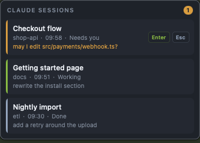

# The HUD, on a Mac

The floating window the Windows side has and this project did not: your Claude
Code sessions, always on top, in the colour that says which one is waiting for
you.



Native AppKit and SwiftUI, 488 KB, and **no Xcode**. `swiftc` out of the
Command Line Tools can see AppKit and SwiftUI, and an `.app` is a folder with a
plist in it — there is nothing here that needs a project file. That matters:
asking someone to download 10 GB of Xcode to get a window would be a poor
trade.

## Building

```sh
./build.sh           # build build/Claude Sessions HUD.app
./build.sh test      # run the tests
./build.sh install   # build, put it in ~/Applications, start it
```

You also need the service. The HUD reads nothing itself; it asks
`session-api.ps1` on port 8787. If that is not running, the window says so
rather than showing you an empty list.

## How it fits in

```
beacon.ps1 → session-status/*.json → session-api.ps1 → :8787/sessions.json → HUD
```

One source of truth. The HUD does not know about Claude Code, does not read
status files and knows nothing about hooks — that is one fewer place where the
picture can drift away from the facts, and it means the window agrees with the
status page and the display by construction rather than by care.

It also means **the HUD needs no Automation permission of its own.** Raising a
window is done by the service with `osascript`, and that already has it.

| File | Does |
|---|---|
| `DeckAPI.swift` | the three HTTP calls; the only place that knows the address and the token |
| `SessionStore.swift` | polling, decoding, publishing state |
| `Settings.swift` | reading and writing `hud-macos.json` |
| `Strings.swift` | user-visible text, mirroring `langlib.ps1` |
| `Notifier.swift` | the beep, and the rule about when not to beep |
| `HUDPanel.swift` | the window: level, dragging, remembering where it was |
| `SessionListView.swift` | the rows |
| `DeckMenu.swift` | right-click, plus start-at-login |
| `main.swift` | tying it together |

The first four need no screen and are what the tests drive.

## Using it

| Action | Does |
|---|---|
| Click a row | brings that terminal to the front |
| Drag | moves the window; the position is remembered |
| Right-click | the menu |
| `Enter` / `Esc` on an orange row | approve / reject |

Colours are taken from `hud.ps1` and the status page rather than picked again:
**orange** needs you, **green** is working, **grey-blue** is done. Only orange
beeps, and only on the change — a session that needs you stays orange until you
deal with it, and announcing the state rather than the change would beep thirty
times a minute.

The `Enter` and `Esc` buttons appear only on an orange row. The service refuses
them on a session that is not asking for anything (`requireAttention` in
`actions.json`), so showing them elsewhere would promise something that does not
happen. The warning from the main README still applies: that button confirms
whatever is on your screen at that moment.

### Right-click

```
✓ Always on top
  Compact rows
  Only sessions that need me (hides the rest)
  Hide sessions                ▸
─────────────────────────────────
  Open status page
  Address of this Mac:  <ip>:8787
─────────────────────────────────
  Start when I log in
─────────────────────────────────
  Restart HUD
  Quit HUD
```

"Start when I log in" writes **two** LaunchAgents, one for the service and one
for the window. The HUD without the service is an empty window, and two
switches for one outcome is one switch too many. Without PowerShell on the
machine the item says so instead of quietly doing nothing.

## Language

`Strings.swift` mirrors `langlib.ps1` key for key, and follows the same rule:
Dutch if the system asks for Dutch, English for everything else. Adding a
language is copying the `en` table and translating the values.

The state labels — "Needs you", "Working", "Done" — are not in there. Those
come from the service, already translated, in the `label` field.

## Settings

`~/Library/Application Support/ClaudeDeck/hud-macos.json` — position, the three
switches, and which sessions you hid. Written as soon as you change something.

`actions.json` stays the service's. The HUD reads the `token` out of it and
never writes to it.

## Testing

```sh
./build.sh test
```

Thirty-four checks on the part without a window: decoding what the service
sends (including an empty list, nonsense, and a session with everything but the
id missing), the ordering, the filters, the settings file, the token rule, both
string tables carrying the same keys, and the rule about when to beep.

Plain asserts rather than XCTest: XCTest wants a test bundle, a bundle wants
SwiftPM, and SwiftPM here would exist solely to run thirty-four checks.

For the rest there is a way round. `CLAUDEDECK_PORT` points the window at
another port, so you can put a stand-in there and look at the states you would
otherwise have to sit and wait for:

```sh
python3 Tests/fake-service.py &
CLAUDEDECK_PORT=8799 "./build/Claude Sessions HUD.app/Contents/MacOS/ClaudeSessionsHUD"
```

That serves one session in each state. Stop it while the window is running and
you see immediately what happens when the real one goes away.

`HUD_DEBUG=1` prints where the window ended up, on which screens, and what the
menu would say. That is not leftover scaffolding: a borderless panel on the
wrong screen is indistinguishable from one that never opened, and on a second
monitor that is exactly what happens.

## What is not in it

- No menu bar icon — the ask was for the floating window
- Nothing from the display half of the Windows menu (cracktro, releasing the
  USB port); that belongs with `cyd/`
- No Ctrl-click with window scores: that scores Windows windows against each
  other, and there is no such list here

## Known limitation

Raising a window is coarser than on Windows, for the reason the main README
already gives: `osascript` gets you the right *application* and the application
decides which tab is in front. That lives in the service, not here.
